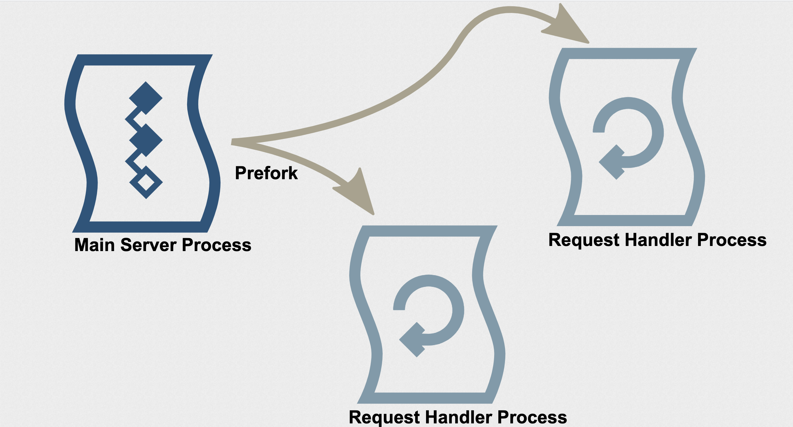
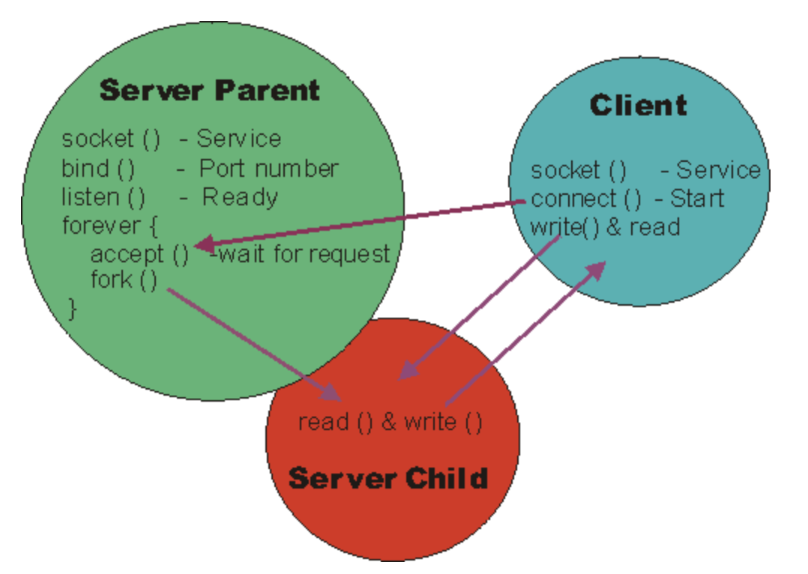
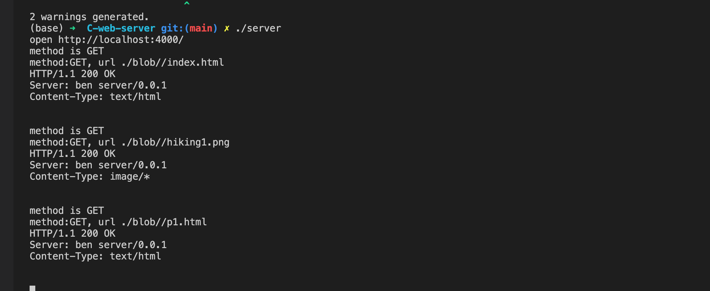

<style>
    h1 {
        text-align:center ;
    }
    h2 {
        text-align:center; 
    }
    body{
        font-size:20px;
    }

</style>

# Project: A Http Web Server Based on C and Linux API 


## Name: wenbin huang 

## NetID: vx3255 

## Course: Advanced Computer Network

---

# Motivation 
# Design
# Implementation 
# Application Demo Show 

---

# Motivation 

1. Have a deep understanding of how a web server works.
2. Dive into HTTP protocol.
3. Get familiar with socket programming under Linux.
4. Get familair with C for system programming under Linux. 


---

# Design: Multi-Threading Based Model  



---

# Design: Socket Creation, Listening and Connection 




---
# Implementation: socket and pthread interface 

- socket()
- bind()
- accept()
- connect()
- send()
- recv()
- pthread_create()
---

# Implementation: Data Structure  

```
typedef struct Header {
    char *name;
    char *value;
    struct Header *next;
} Header;

typedef struct Request {
    char method[128];
    char url[128];
    char version[128];
    struct Header *headers;
    char *body;
} Request;

```


---
# Implementation: startServer

```
int startServer(u_short servPort) {
    
    //1. create a server socket
    servSocket = socket(PF_INET, SOCK_STREAM, 0);


    struct sockaddr_in servAddr;

    //2. bind the current port to the server socket
    if (bind(servSocket, (struct sockaddr *)&servAddr, sizeof(servAddr)) < 0) {
        error("bind socket fails");
    }

    //3. start listening  requests. 
    if (listen(servSocket, 30) < 0) {
        error("listen socket fails");
    }

    return servSocket;
}

```

---
# Implementation: serve 

```
void serve(int servSocket) {
    while(1) {
    
        //1. accept client socket
        int clientSocket = accept(servSocket, (struct sockaddr *) &clientAddr, &clientAddrLen);
            ...
            ...
        //2. fork a child thread and then handle request.  
        int createReuslt = pthread_create(&thread, NULL, (void *)requestHandler, (void *)(intptr_t)clientSocket);
        if (createReuslt != 0) {
            error("pthread creation fails");
        }
    }

    close(servSocket);
}
```
---
# Implementation: requestHandler 

```
void requestHandler(void *arg)
{
    int client = (intptr_t)arg;
    char buf[1024];

    //1. parse a request 
    Request* request = parseRequest(client, buf);

    printf("method:%s, url %s\n",request->method,  request->url);

    ```
    ```
    ```
    //2. get the static files 
    sendStaticFiles(client, request->url, request->url);

    free(request);
    close(client);
}
```

---
# Application Demo Show: start web server 




---
# Application Demo Show: A Simple Hiking Blog 


---

# Thanks 

## Reference 

1. https://berb.github.io/diploma-thesis/original/042_serverarch.html

2. https://www.ibm.com/developerworks/systems/library/es-nweb/index.html
